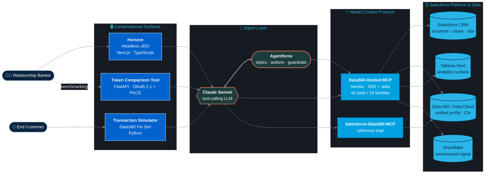

<!--
  IMPORTANT: commas in capsule-render's color= param MUST be %2C-encoded
  inside srcset (and ideally in src too). HTML5 srcset parsing treats raw
  commas as candidate separators, which silently truncates the URL and
  drops &text=, &desc=, animation, etc. Don't "simplify" these to plain
  commas — you'll lose the name and subtitle from the rendered banner.
-->
<picture>
  <source media="(prefers-color-scheme: dark)" srcset="https://capsule-render.vercel.app/api?type=waving&color=0:0A2540%2C50:0062CC%2C100:29B5E8&height=220&section=header&text=Jose%20Sifontes&fontSize=56&fontColor=ffffff&animation=fadeIn&fontAlignY=38&desc=Data%20Science%20%7C%20Engineering%20%7C%20AI&descAlignY=58&descSize=22&descColor=cfe8ff" />
  <source media="(prefers-color-scheme: light)" srcset="https://capsule-render.vercel.app/api?type=waving&color=0:00A1E0%2C50:29B5E8%2C100:9CD7FF&height=220&section=header&text=Jose%20Sifontes&fontSize=56&fontColor=ffffff&animation=fadeIn&fontAlignY=38&desc=Data%20Science%20%7C%20Engineering%20%7C%20AI&descAlignY=58&descSize=22&descColor=ffffff" />
  
</picture>

  

  
  
  
  

---

## 🧑‍💻 About Me

I'm a **Distinguished Technical Architect on Data and AI at Salesforce** with deep roots in data — from wrangling raw datasets to deploying ML models in production. I hold an **M.S. in Data Science from Northwestern University** and an **M.S. in Data Engineering from WGU** and bring a rare combination of technical depth and customer-facing consultative experience across the data and AI space.

Before tech, I served in the **U.S. Military**, which shaped my approach to problem solving: methodical, high-stakes, and mission-first. I'm fluent in **English and Spanish**, based in **Miami, FL**, and equally at home in a Jupyter notebook and a customer discovery call.

| | |
|---|---|
| 🔭 **Building** | AI/ML integrations with Salesforce Data Cloud & Snowflake |
| 🌱 **Exploring** | LLMs, Agent-to-Agent (A2A) protocols, MCP, AI/ML DevOps |
| 💬 **Ask me about** | Data Science, ML, Data Governance, Analytics Engineering |
| 🌎 **Languages** | English, Spanish |
| ✍️ **Blog** | [analyticsmadesimple.com](https://analyticsmadesimple.com) |
| 🎖️ **Fun fact** | Military veteran, oenophile, and permanent resident of the rabbit hole |

---

## 🧭 What I Build

> The recurring shape across most of my work — agentic, conversation-first UIs talking to enterprise data through MCP. Click any node to jump to a representative repo.

---

## 🛠️ Tech Stack

**Languages**

  

**Data, ML & Analytics**

  
  
  
  
  
  
  
  
  

**AI & LLM Frameworks**

  
  
  
  
  
  
  
  
  

**Cloud, Platforms & Databases**

  
  
  
  
  
  
  
  

**Frontend & Web**

  

**Tools**

  
  
  

---

## 📊 GitHub Stats

  

  

<!--
  Snake animation below is generated daily by .github/workflows/snake.yml
  and pushed to the `output` branch as an SVG. The README references it
  directly from this repo — no third-party render-time dependency.
-->

  <picture>
    <source media="(prefers-color-scheme: dark)" srcset="https://raw.githubusercontent.com/josers18/josers18/output/github-snake-dark.svg" />
    <source media="(prefers-color-scheme: light)" srcset="https://raw.githubusercontent.com/josers18/josers18/output/github-snake.svg" />
    
  </picture>

---

## ✍️ Writing & Articles

> Published on [LinkedIn](https://www.linkedin.com/in/jsifontes/recent-activity/articles/) · More at [analyticsmadesimple.com](https://analyticsmadesimple.com)

### 📌 Featured Articles

<!-- TODO: replace these LinkedIn-articles-tab URLs with the real article permalinks -->

| Article | Date |
|---|---|
| [Data Clean Rooms: Navigating the Future of Privacy and Collaboration](https://www.linkedin.com/in/jsifontes/recent-activity/articles/) | Jan 2024 |
| [Data Governance 101](https://www.linkedin.com/in/jsifontes/recent-activity/articles/) | Nov 2023 |
| [ETL vs ELT & Beyond: Choosing Your Data Integration Approach](https://www.linkedin.com/in/jsifontes/recent-activity/articles/) | Sep 2023 |
| [Getting Up to Speed on Vector Databases](https://www.linkedin.com/in/jsifontes/recent-activity/articles/) | Sep 2023 |

### 📰 Latest from analyticsmadesimple.com

<!-- BLOG-POST-LIST:START -->- [Hosted open models vs download to your machine](https://analyticsmadesimple.com/tutorials/hosted-open-models-vs-download-to-your-machine/) (Aug 27, 2026)- [Grok models chooser: 4.5, 4.6, and when to switch](https://analyticsmadesimple.com/tutorials/grok-models-chooser-4-5-4-6/) (Aug 27, 2026)- [Definitions and metric specs](https://analyticsmadesimple.com/analytics/definitions-and-metric-specs/) (Aug 27, 2026)- [What is an embedding?](https://analyticsmadesimple.com/key-terms/what-is-an-embedding/) (Aug 27, 2026)- [What is a feature store?](https://analyticsmadesimple.com/key-terms/what-is-a-feature-store/) (Aug 27, 2026)<!-- BLOG-POST-LIST:END -->

> _Auto-updated daily via [`blog-post-workflow`](https://github.com/gautamkrishnar/blog-post-workflow)._

---

## 🚀 Featured Projects

> A curated set of work focused on **Salesforce Data 360, Agentforce, and MCP**. Full repo list on [my GitHub](https://github.com/josers18?tab=repositories).

| Project | What it does |
|---|---|
| **[Horizon — Headless-JDO](https://github.com/josers18/Headless-JDO)**   `TypeScript · Next.js · MCP · Claude` | Headless home page for the relationship banker. Claude Sonnet orchestrates Salesforce CRM, Data Cloud, and Tableau Next MCP servers behind a no-navigation, conversation-first UI. |
| **[Data360-Hosted-MCP](https://github.com/josers18/Data360-Hosted-MCP)**   `JavaScript · Heroku · MCP` | Salesforce Data 360 / Data Cloud MCP server with **43 tools across 16 families** — Heroku-hosted, dual-transport (SSE + stdio), with read-only and destructive-action guardrails. |
| **[Salesforce-Data360-MCP](https://github.com/josers18/Salesforce-Data360-MCP)**   `Python · MCP · ⭐ 1` | Quick-start setup and demo for implementing MCP against Salesforce Data 360 (Data Cloud) — the reference implementation for the hosted variant above. |
| **[Token-Comparison-Tool](https://github.com/josers18/Token-Comparison-Tool)**   `Python · FastAPI · OAuth 2.1` | Benchmark token cost: Salesforce native (`sf` CLI) vs Salesforce-hosted MCP servers. OAuth 2.1 + PKCE, free-format prompts, PDF export. |
| **[Data360 Financial Transaction Simulator](https://github.com/josers18/Salesforce-Data360-Financial-Transaction-Simulator)**   `Python · Snowflake · Data Cloud` | Financial transaction simulator with overdraft prevention, balance tracking, and Salesforce Data Cloud / Snowflake integration. |
| **[Salesforce](https://github.com/josers18/Salesforce)**   `Python · ⭐ 5` | Long-running grab-bag of Salesforce-related code, snippets, and experiments — most-starred repo on this profile. |
| **[JDO — Jose's Demo Org](https://github.com/josers18/JDO)**   `Salesforce DX · Apex · LWC` | Assets and Salesforce DX projects for demo orgs: LWCs, Apex, flows, docs, and related demos. |

📚 <b>Reference & Learning Repos</b> (click to expand)

| Project | What it does |
|---|---|
| **[LangChain-Concepts](https://github.com/josers18/LangChain-Concepts)** | Reference guide for building LLM apps with LangChain — prompt templates, LCEL chains, agents, tools, RAG pipelines. |
| **[OpenAI-API-Tutorial](https://github.com/josers18/OpenAI-API-Tutorial)** | Reference guide for the OpenAI API, Hugging Face Transformers, embeddings, semantic search, ChromaDB, and Pinecone. |
| **[Python-Data-Structures](https://github.com/josers18/Python-Data-Structures)** | Personal reference for Python DS&A — Big O, linked lists, stacks, queues, trees, graphs, sorting, DP. |
| **[Python-Programming-Concepts](https://github.com/josers18/Python-Programming-Concepts)** | Reference guide for Python — OOP, error handling, testing with pytest and unittest. |
| **[Git-Tutorial](https://github.com/josers18/Git-Tutorial)** | Personal Git reference — init, branching, merging, remotes, stashing, tags. |

---

## 🎓 Education & Certifications

> A selection of credentials. Full list on [LinkedIn](https://www.linkedin.com/in/jsifontes).

**🎓 Education**

| Credential | Issuer |
|---|---|
| M.S. Data Science | Northwestern University |
| M.S. Data Engineering | Western Governors University |

**📊 Data, Analytics & AI**

| Credential | Issuer |
|---|---|
| Google Analytics Individual Qualification | Google |
| Data Scientist with R | DataCamp |
| Data Analyst with R | DataCamp |
| R Programming in Data Science: High Volume Data | LinkedIn Learning |

🛠️ <b>IT & Infrastructure Foundations</b> (click to expand)

| Credential | Issuer |
|---|---|
| MCP — Microsoft Certified Professional | Microsoft |
| MCTS — Windows 7 | Microsoft |
| Exam 413: Designing & Implementing Server Infrastructure | Microsoft |
| IT Operations Specialist | CompTIA |
| A+ | CompTIA |
| Network+ | CompTIA |

---

